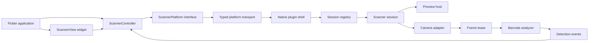
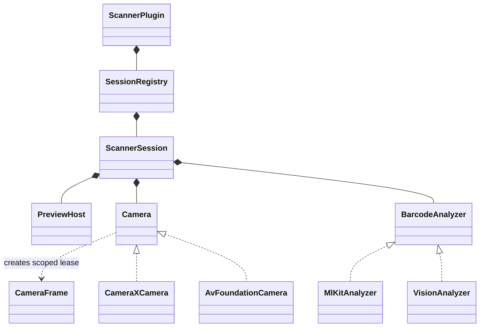
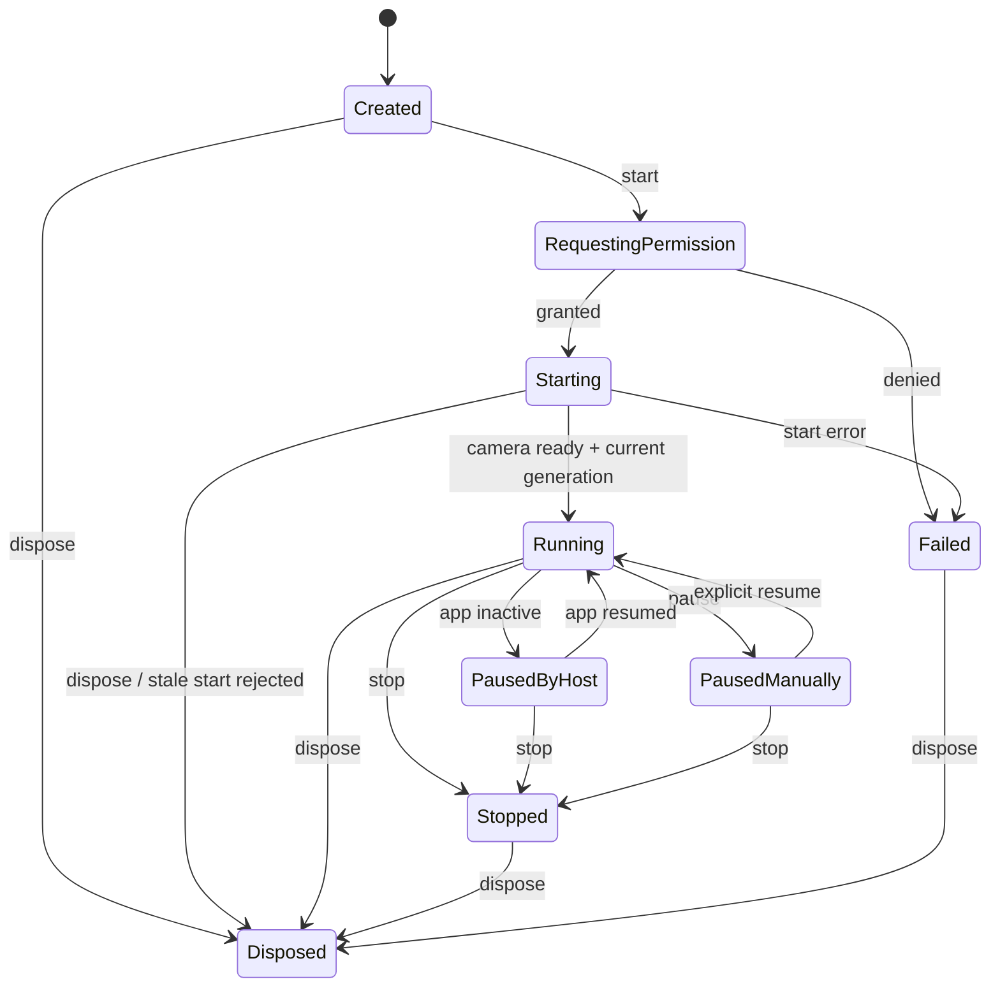
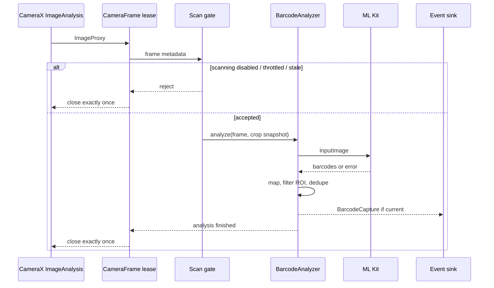

# Архитектура Flutter-плагина камеры и сканера штрихкодов

> Практический blueprint для проектирования похожего плагина на Dart/Flutter с нативными реализациями Android и iOS. Состояние внешних источников проверено 2026-08-24.

## 1. Назначение документа

Этот документ отвечает не только на вопрос «из каких классов состоит scanner plugin», но и на более важные вопросы:

- где проходит граница между Flutter API, камерой и распознавателем;
- кто владеет камерой, кадром, detector, preview и подписками;
- как не допустить гонок при `start`, `stop`, `dispose`, пересоздании view и смене Activity;
- как передавать команды и поток результатов через platform channels;
- как совместить preview, crop/scan window, поворот и координаты найденного ШК;
- какие части можно заменить без переписывания всего плагина;
- какие тесты нужны, чтобы плагин был воспроизводимым, а не только «работал на одном телефоне».

Под «штрихкодом» далее понимаются и линейные коды, и QR/Data Matrix/PDF417 и другие 2D-форматы.

## 2. Изученные образцы и главный вывод

| Проект | Архитектурная роль | Что стоит перенять | Что не следует копировать буквально |
| --- | --- | --- | --- |
| [`camera`](https://github.com/flutter/packages/tree/main/packages/camera) | Универсальный camera plugin без распознавания | Federated plugin, `CameraController` + immutable `CameraValue`, platform interface, идентификатор camera instance, события, capability checks | Передача каждого кадра в Dart слишком дорога, если распознавание всё равно выполняет нативный ML Kit |
| [`mobile_scanner`](https://github.com/juliansteenbakker/mobile_scanner) | Камера и распознавание в одном plugin | Controller как единая точка управления, отдельный stream распознаваний, platform interface, texture preview, scan window, разные нативные backend'ы | Большой production-класс камеры не является готовой архитектурой владения; важнее его публичный контракт и уроки исправлений lifecycle |
| [`google_mlkit_barcode_scanning`](https://github.com/flutter-ml/google_ml_kit_flutter/tree/develop/packages/google_mlkit_barcode_scanning) | Только распознаватель, без владения камерой | Разделение capture и recognition, `InputImage` как вход, detector instance ID, явный `close()` | Camera image проходит через Dart и channels; для непрерывного scanner pipeline это добавляет копирование и coordination overhead |
| [`qr_code_scanner`](https://github.com/juliuscanute/qr_code_scanner) | Старый PlatformView-подход | Простая модель: native preview внутри Flutter, controller + scan stream | Проект находится в maintenance mode и опирается на устаревшие backend'ы; это источник исторических решений, не целевой шаблон |
| Текущий `mlkit_scanner` | PlatformView + CameraX/AVFoundation + ML Kit | На Android одна `ScannerSession` владеет единственным CameraX/analyzer pipeline, хранит отдельное состояние каждой view по `viewId` и переносит общий preview между ними | Команды и результаты адресуются по `viewId`; Dart-channel остаётся singleton-транспортом одного Flutter engine |

Главный вывод: хороший scanner plugin — это не «виджет, который вызывает ML Kit», а набор независимых контрактов вокруг одной scanner session. Камера и распознаватель должны встречаться в нативном pipeline; Dart должен управлять сессией, отображать состояние и получать компактные результаты.

### Текущая multi-view policy Android

- На один Flutter engine существует не более одной `ScannerSession` и одного CameraX/analyzer pipeline.
- Каждый `PlatformView` регистрируется по устойчивому Flutter `viewId`. Lifecycle- и конфигурационные команды передают этот идентификатор и меняют только соответствующий `ScannerViewState`.
- `ScannerViewState` хранит camera/scan intent, zoom, torch, crop и задержку после успешного распознавания. Неактивная view может обновить своё состояние, не меняя физическую камеру текущего preview-host.
- После CameraX binding или переноса preview сессия применяет абсолютные zoom/torch через те же методы, которые используются runtime-командами, восстанавливает crop/delay и только затем показывает preview и разрешает анализ. Новая view использует собственные initial-параметры; отсутствие zoom/torch означает Android defaults `0.0`/`false`, а не наследование предыдущей view.
- `CameraControlState` внутри `XCamera` хранит только фактически подтверждённые CameraX controls для технического rebind/повторного открытия той же физической камеры. Источником пользовательской конфигурации между view остаётся `ScannerViewState`.
- Один Android `PreviewView` физически не может иметь несколько родителей. Регистрация и удаление view не определяют порядок экранов и не выбирают новый preview-host. `captureCamera(viewId)` явно выбирает создаваемую или возвращаемую view, восстанавливает её сохранённую конфигурацию и возобновляет только ранее запрошенное сканирование.
- `unbind` всегда удаляет указанную view. Удаление view, которая не содержит preview, не влияет на остальные view и общую камеру.
- Результаты содержат `viewId`; Dart broadcast stream фильтруется так, что событие получает только подписка текущего preview-host.
- Dispose Flutter-виджета отменяет только его локальную Dart-подписку и удаляет его platform view; он не вызывает глобальный `cancelScan`, пока существуют другие view.
- При пустом реестре камера и сканирование сразу приостанавливаются, но их запрошенное состояние сохраняется, а освобождение ресурсов откладывается на единый navigation grace-период `ScannerSessionImpl.NAVIGATION_GRACE_PERIOD_MS`. Регистрация новой view отменяет задачу, а `captureCamera(viewId)` выбирает host и восстанавливает camera/scan state без переинициализации pipeline; если новых view не появилось, сессия освобождает камеру и analyzer.

## 3. Рекомендуемый архитектурный стиль

Для нового плагина рекомендуются четыре уровня:

1. **App-facing Dart API** — widget, controller, state, typed models и ошибки.
2. **Dart platform interface** — абстрактный контракт платформы без Kotlin/Swift деталей.
3. **Native plugin shell** — Flutter lifecycle, platform channel, permission и registry сессий.
4. **Native scanner core** — session, camera adapter, analyzer, frame lease, geometry и result mapping.



### Почему именно так

- Flutter API остаётся одинаковым при замене CameraX, ML Kit, AVFoundation или Web backend.
- Нативный код не зависит от жизненного цикла конкретного Flutter widget глубже, чем session/view binding.
- Камеру и распознаватель можно тестировать через узкие fake-контракты.
- Сложные lifetime-инварианты находятся рядом с ресурсами, к которым относятся.
- Для нескольких одновременных Flutter engine и controller нет скрытого глобального состояния.

## 4. Публичный Dart API

### 4.1. Controller — владелец пользовательского состояния

Controller должен быть единственной программной точкой управления сессией. Удобная форма — `ValueNotifier<ScannerState>` или `ChangeNotifier` с одним immutable state.

Минимальный контракт:

```dart
abstract interface class ScannerController {
  ScannerState get value;
  Stream<BarcodeCapture> get detections;

  Future<void> start();
  Future<void> stop();
  Future<void> pause();
  Future<void> resume();
  Future<void> setTorch(TorchMode mode);
  Future<void> setZoom(double linearZoom);
  Future<void> setScanWindow(NormalizedRect? window);
  Future<BarcodeCapture?> analyzeImage(String path);
  Future<void> dispose();
}
```

`ScannerState` должен хранить согласованный снимок, а не набор независимых notifier'ов:

```dart
@immutable
final class ScannerState {
  final ScannerLifecycle lifecycle;
  final CameraFacing facing;
  final TorchState torch;
  final double zoom;
  final Size? previewSize;
  final ScannerFailure? failure;
}
```

Обязательные свойства API:

- `start()` завершается только после достижения документированного состояния: рекомендуется «preview и analyzer действительно готовы»;
- параллельные `start()` либо разделяют один initialization future, либо второй вызов получает стабильную ошибку `controllerInitializing`;
- `stop()` и `dispose()` идемпотентны;
- после `dispose()` никакой старый callback не изменяет state и не публикует barcode;
- команды до инициализации имеют явно выбранную семантику: error, no-op или deferred; разные платформы не должны вести себя по-разному;
- lifecycle приложения не спрятан полностью в widget: пользователь должен иметь возможность явно управлять политикой pause/resume.

### 4.2. Widget — только композиция preview и Flutter overlay

Widget отвечает за:

- создание/привязку preview;
- передачу фактических layout constraints;
- Flutter overlay, gestures и accessibility;
- автоматический `start`, только если это часть публичного контракта;
- подписку на controller state без владения нативными ресурсами.

Widget не должен быть скрытым владельцем controller. Если controller передан пользователем, widget не вызывает его `dispose()`. Если widget создал внутренний controller, обязан освободить именно его.

### 4.3. Модели результата

Результат одного прохода распознавания лучше представлять контейнером, а не одиночным `Barcode`:

```dart
final class BarcodeCapture {
  final List<Barcode> barcodes;
  final Size sourceSize;
  final int rotationDegrees;
  final Uint8List? image; // Только по явному opt-in.
  final int sequence;
  final DateTime timestamp;
}
```

`Barcode` должен сохранять максимум переносимой семантики backend'а:

- `rawValue` и nullable `displayValue`;
- `rawBytes`, если платформа их предоставляет;
- `format` и `valueType`;
- `boundingBox` и corner points;
- структурированные данные: URL, Wi-Fi, email, contact, calendar и т. п. — только если API обещает их поддерживать одинаково;
- неизвестные enum-значения должны превращаться в `unknown`, а не ломать decoding.

Нельзя молча подменять `null` пустой строкой: это меняет смысл данных и затрудняет межплатформенную совместимость.

## 5. Platform interface и федерация

Официальная архитектура Flutter разделяет app-facing package, platform interface и platform implementations. Для camera/scanner это оправдано, если:

- планируются Android, iOS, macOS и web;
- platform backend'ы выпускаются независимо;
- сторонние команды смогут добавлять реализации;
- нужно заменять Android CameraX backend без изменения app-facing API.

Для небольшого Android+iOS plugin допустим один package, но platform interface всё равно следует выделить внутри `lib/src`. Переход к package federation тогда останется механическим.

Пример структуры federated plugin:

```text
scanner_plugin/
  lib/src/
    scanner_controller.dart
    scanner_widget.dart
    models/
  example/

scanner_plugin_platform_interface/
  lib/src/
    scanner_platform.dart
    method_channel_scanner.dart
    models/

scanner_plugin_android/
  lib/
  android/src/main/kotlin/.../

scanner_plugin_ios/
  lib/
  ios/Classes/
```

При использовании Pigeon сгенерированные Dart и host-файлы должны оставаться внутренней парой, созданной одной версией генератора. Не стоит публиковать generated API как публичный API или класть Dart-часть generated protocol в platform-interface package, а Kotlin/Swift-часть — в независимо обновляемый implementation package.

## 6. Транспорт Dart ↔ native

### 6.1. Команды и события следует разделить

- Команды и ответы: Pigeon Host API либо `MethodChannel`.
- Длительные потоки: Pigeon EventChannel API, `EventChannel` или один типизированный native-to-Dart callback stream.
- Preview: texture ID либо platform view ID, а не байты каждого preview frame.

Минимальный протокол:

| Направление | Операция | Рекомендуемый ответ |
| --- | --- | --- |
| Dart → native | `createSession(config)` | `sessionId`, capabilities |
| Dart → native | `start(sessionId)` | только после camera ready |
| Dart → native | `stop(sessionId)` | после прекращения публикации кадров |
| Dart → native | `setTorch`, `setZoom`, `setScanWindow` | применённое значение или typed error |
| Dart → native | `analyzeImage(path)` | nullable `BarcodeCapture` |
| Dart → native | `disposeSession(sessionId)` | после idempotent cleanup |
| native → Dart | `stateChanged` | session-scoped state |
| native → Dart | `barcodeDetected` | `BarcodeCapture` |
| native → Dart | `error` | code, message, details, recoverable |

Каждое сообщение должно содержать `sessionId`. Для асинхронных camera/detector callback'ов полезен также `generation`: callback от предыдущего запуска отбрасывается, даже если ID сессии ещё существует.

### 6.2. Валидация границы

Если используется raw `MethodChannel`, `Any?`/`dynamic` разрешены только в transport adapter. Там единожды проверяются:

- наличие и тип каждого поля;
- `NaN`/`Infinity` для `double`;
- диапазоны zoom, delay, rotation и enum code;
- нормализованный crop и его политика выхода за preview;
- совместимость команды с текущим состоянием;
- допустимый размер бинарного payload.

После parsing внутрь session передаются только typed value objects. Force cast вида `arguments as Map<String, Any?>` не должен быть способом валидации.

### 6.3. Ошибки — часть публичной совместимости

Предпочтительны смысловые стабильные коды:

```text
permissionDenied
cameraUnavailable
cameraInitializing
controllerUninitialized
sessionDisposed
unsupportedFeature
invalidArguments
recognizerFailure
```

В `details` полезно передавать platform, native error type, operation и recoverability. Stack trace не следует безусловно отдавать в release build.

## 7. Рендеринг preview: осознанный выбор

| Подход | Когда выбирать | Плюсы | Цена |
| --- | --- | --- | --- |
| Flutter `Texture` | Preview и overlay должны свободно трансформироваться как Flutter widgets | Хорошая Flutter-композиция, чистый overlay на Dart, нет полноценного native view в дереве | Нужно управлять surface/texture lifecycle и orientation metadata |
| `PlatformView` | Нужен готовый native preview view, нативные overlay/gestures/focus | Проще встроить `PreviewView`/`UIView`, удобно держать camera UI нативно | Composition trade-offs, отдельный view lifecycle, сложнее гарантировать соответствие Flutter overlay и sensor coordinates |
| Поток кадров в Dart | Алгоритм реально работает в Dart или кадры нужны клиенту | Максимальная гибкость на Dart-стороне | Копирование больших buffers, GC pressure, latency; плохой default для native ML Kit |
| Отдельный Activity/ViewController | Только one-shot scan flow без встраиваемого preview | Очень простая интеграция | Плохая композиция, навигация и кастомизация; не подходит как основной scanner widget |

Текущий проект выбрал `PlatformView`: Android `PreviewView` находится внутри `ScannerView`, а Flutter создаёт его через `PlatformViewLink`. Для похожего API это нормальный выбор при условии, что session адресуется view ID и disposal старого view не может уничтожить ресурсы нового.

Для нового cross-platform plugin с Flutter overlay по умолчанию предпочтителен texture. `mobile_scanner` демонстрирует связку CameraX `Preview.SurfaceProvider` с Flutter `TextureRegistry.SurfaceProducer`. PlatformView стоит сохранять, если native focus/visor UI является сознательной функциональной частью продукта.

## 8. Модель владения ресурсами

У каждого mutable-ресурса должен быть ровно один владелец и один idempotent disposer.

| Владелец | Ресурсы и ответственность |
| --- | --- |
| Plugin instance | engine attachment, channel registration, session registry |
| Activity binding | permission listener и host lifecycle observer |
| Session | initialization future, generation, pause reason, camera/analyzer binding |
| Preview host | native view или texture/surface, layout и gestures |
| Camera adapter | camera provider/device, preview и analysis use cases/output |
| Analyzer | ML Kit/Vision detector, throttle и duplicate policy |
| Frame lease | один `ImageProxy`/sample buffer и временные converted buffers |
| Event subscription | связь одного consumer с одним session ID |



Критические правила:

- disposer можно вызвать повторно без исключения и побочных эффектов;
- старый session не освобождает camera/texture нового session;
- `detachForConfigChanges` не всегда равен окончательному `detach`;
- plugin не предполагает, что во всём процессе существует только один Flutter engine;
- статические singleton-поля не хранят engine-, Activity- или session-scoped state;
- unregister выполняется тем же экземпляром listener, который был зарегистрирован.

## 9. State machine сессии

Не стоит кодировать жизненный цикл комбинацией разрозненных boolean-полей. Нужна явная resource state machine и отдельная scan policy.



`scanEnabled` лучше хранить отдельно от camera resource state: можно показывать preview без распознавания, временно приостановить analyzer или сменить scanning policy без полного camera restart.

### Асинхронная валидность

Каждый `start` получает token/generation. Completion может менять session только если одновременно истинны условия:

1. session ещё не disposed;
2. generation совпадает с текущим;
3. preview binding всё ещё принадлежит session;
4. native camera binding ещё является owned binding;
5. `Result`/Future ещё не завершён.

Такая проверка нужна для camera provider future, permission result, ML Kit task, delayed throttle callback, texture cleanup и route/view recreation.

## 10. Нативный scanner pipeline

Рекомендуемый поток Android:



### 10.1. Backpressure

Для realtime scanning очередь кадров обычно вреднее, чем пропуск. На Android следует использовать `ImageAnalysis.STRATEGY_KEEP_ONLY_LATEST`; analyzer либо сериален, либо явно отбрасывает overlap. На iOS `AVCaptureVideoDataOutput.alwaysDiscardsLateVideoFrames` должен отражать ту же политику.

Throttle измеряется монотонным временем, а не wall clock. Нужно заранее определить, что означает delay:

- задержка после каждого принятого кадра;
- задержка только после успешного detection;
- максимальная частота публикации событий при непрерывном распознавании.

Это разные публичные контракты. В текущем Android-коде delay запускается после каждой попытки анализа и имеет нижнюю границу около одного 60 FPS frame.

### 10.2. Frame lease

`ImageProxy` должен закрываться ровно один раз во всех путях: success, empty result, exception, rejection, cancellation и dispose. Закрывать нужно `ImageProxy`, а не вложенный `Media.Image`.

Удачная форма контракта уже есть в текущем проекте:

```kotlin
interface CameraFrame : AutoCloseable {
    val width: Int
    val height: Int
    val rotationDegree: Int

    fun <T> useNv21(
        cropRect: Rect?,
        block: (ByteArray, Int, Int, Int) -> T,
    ): T
}
```

Буфер живёт только внутри callback, поэтому его нельзя случайно сохранить после возврата в pool. Для async detector lease должен жить до завершения detector task либо frame должен быть безопасно скопирован до запуска task.

### 10.3. Direct image против конвертации

Есть два корректных pipeline:

1. **Zero/minimal-copy:** `ImageProxy.image` + rotation → `InputImage.fromMediaImage`; bounding box результата фильтруется по scan window. Это предпочтительно, когда важна latency и полный frame приемлем.
2. **Physical ROI:** YUV_420_888 корректно копируется в cropped NV21 → `InputImage.fromByteArray`. Это оправдано, если уменьшение площади заметно ускоряет detector или full-frame recognition запрещено продуктовым контрактом.

Physical ROI требует учитывать `rowStride`, `pixelStride`, `Buffer.position/limit`, UV layout, rotation и чётные границы YUV 4:2:0. Пул буферов допустим только с exclusive lease; возвращать массив до завершения recognition нельзя.

### 10.4. Performance policy

- Запрашивать разрешение, достаточное для минимального размера ожидаемого ШК, а не максимальное разрешение сенсора.
- Ограничивать список barcode formats, если продукт знает допустимые форматы.
- `returnImage` делать opt-in: bitmap rotation и JPEG encoding значительно дороже обычного результата.
- Не выполнять detector, YUV conversion, JPEG encoding или ожидание camera provider на main thread.
- Не отправлять raw frame через channel при каждом кадре, если Dart его не использует.
- Профилировать latency p50/p95, dropped frames, allocations и время до первого результата на слабом устройстве.

## 11. Scan window и координаты

Самая частая логическая ошибка scanner plugin — считать Flutter `Rect` и image buffer `Rect` одной системой координат.

Нужно явно моделировать как минимум:

1. Flutter logical pixels widget;
2. фактически видимую область preview после `BoxFit`/`FILL_CENTER`;
3. preview buffer pixels;
4. sensor/image coordinates до rotation;
5. detector coordinates после rotation;
6. mirror transform front camera.

Для каждого кадра analyzer читает один immutable `CropTransformSnapshot`:

```text
widgetSize
previewContentRect
imageSize
rotationDegrees
cameraFacing / mirrored
scaleType
normalizedScanWindow
generation
```

Overlay и analyzer обязаны использовать один mapper. Политика выхода ROI за preview должна быть публичной и тестируемой:

- clip to preview;
- reject as invalid arguments;
- suppress detection, если весь ROI вне preview.

Нельзя визуально нарисовать один visor, а распознавать приблизительно другую область. Для YUV crop конечные координаты выравниваются по чётным значениям. Тесты нужны для rotation `0/90/180/270`, aspect-fill offsets, portrait/landscape, front camera mirror, zero-size layout и ROI на каждой границе.

## 12. Android-реализация

### 12.1. Plugin shell

Android entry point реализует `FlutterPlugin` и, если нужны permissions/host lifecycle, `ActivityAware`. Он должен оставаться тонким:

- зарегистрировать typed transport и preview factory/texture manager;
- attach/detach Activity-scoped collaborators;
- хранить `SessionRegistry`, а не camera internals;
- маршрутизировать команды по `sessionId`;
- при engine detach освободить только свои sessions и listeners.

### 12.2. CameraX adapter

CameraX-детали скрываются за малым `Camera` interface. Adapter владеет только теми `Preview` и `ImageAnalysis`, которые сам создал. При cleanup он вызывает `unbind(ownedUseCases...)`, а не `unbindAll()`: host application или другой plugin могут использовать тот же provider.

Ключевые настройки scanner pipeline:

- lifecycle binding через `bindToLifecycle`;
- back camera как default, но selector — часть config;
- `Preview` и `ImageAnalysis` с согласованным resolution policy;
- `STRATEGY_KEEP_ONLY_LATEST`;
- отдельный serial analysis executor;
- generation guard вокруг async `ProcessCameraProvider.getInstance()`;
- `ImageProxy.close()` в гарантированном ownership scope.

### 12.3. ML Kit adapter

Analyzer создаёт один `BarcodeScanner` на session/configuration и закрывает его при dispose. Пересоздание необходимо, если SDK требует immutable options, например новый набор formats.

Нужно заранее выбрать bundled или unbundled model:

- bundled увеличивает приложение, но доступен сразу;
- Play Services model меньше, но первый запуск зависит от загрузки и должен иметь состояние model-not-ready.

Не копируйте SDK constraints из старого plugin: текущий репозиторий объявляет `minSdk 21`, тогда как актуальная Android-документация ML Kit Barcode Scanning указывает API 23+; это нужно разрешить проверкой выбранной зависимости, merged manifest и device matrix до релиза.

### 12.4. Permissions

Permission gateway должен:

- немедленно вернуть `true`, если всё уже granted;
- объединить одновременные эквивалентные запросы;
- сериализовать разные наборы permissions;
- игнорировать чужие request codes;
- после callback повторно проверить фактический permission state;
- завершить всех waiters при grant, denial, cancellation и окончательном detach;
- не удерживать Activity после detach.

## 13. iOS-реализация

Эквивалентные роли должны существовать и в Swift, даже если API AVFoundation отличается:

- `FlutterPlugin` — transport и session registry;
- preview host — `FlutterTexture` или `FlutterPlatformView`;
- camera adapter — `AVCaptureSession`, device input, preview layer/texture output;
- frame adapter — scoped `CMSampleBuffer`/`CVPixelBuffer`;
- analyzer — ML Kit Barcode Scanning или Apple Vision;
- permission gateway — `AVCaptureDevice.authorizationStatus` и `requestAccess`;
- serial `sessionQueue` для configuration, `startRunning` и `stopRunning`.

Правила:

- `AVCaptureSession.startRunning/stopRunning` не должны блокировать main queue;
- UI, preview layer и Flutter event delivery возвращаются на main queue, когда этого требует API;
- input/output меняются внутри `beginConfiguration/commitConfiguration` с capability checks;
- sample buffer не переживает разрешённый lifetime без retain/copy;
- orientation и mirroring входят в общий transform contract;
- observers и notifications снимаются тем же owner при dispose;
- слабые ссылки не заменяют явное владение и idempotent cleanup.

Текущая iOS-часть полезна как пример AVFoundation pipeline, но её не следует использовать как целевой lifecycle-шаблон без session ID, generation guards и симметричных Android-инвариантов.

## 14. Web и другие платформы

Если планируется web, federation особенно полезна. Backend может выбирать native `BarcodeDetector` при наличии и fallback на ZXing/WASM. Platform capabilities должны сообщать:

- доступные barcode formats;
- torch/zoom support;
- raw bytes support;
- analyze-from-image support;
- camera facing/lens support.

Публичный API не должен обещать одинаковый `rawBytes`, torch или набор formats там, где backend не может их предоставить. Unsupported feature возвращается типизированно либо отражается в capabilities до вызова.

## 15. Что уже хорошо в текущем `mlkit_scanner`

Android-часть репозитория содержит хороший задел для целевой архитектуры:

- [`MlkitScannerPlugin.kt`](src/main/kotlin/com/dns_technologies/mlkit_scanner/MlkitScannerPlugin.kt) отделяет Flutter/Activity lifecycle и dispatch;
- [`ScannerSession.kt`](src/main/kotlin/com/dns_technologies/mlkit_scanner/models/ScannerSession.kt) задаёт session boundary;
- [`Camera.kt`](src/main/kotlin/com/dns_technologies/mlkit_scanner/scanner/components/camera/Camera.kt) скрывает CameraX;
- [`CameraFrame.kt`](src/main/kotlin/com/dns_technologies/mlkit_scanner/scanner/components/camera/CameraFrame.kt) задаёт scoped frame ownership;
- [`ImageBarcodeAnalyzer.kt`](src/main/kotlin/com/dns_technologies/mlkit_scanner/scanner/components/analyzer/ImageBarcodeAnalyzer.kt) централизует serialization, throttle и dispose;
- [`XCamera.kt`](src/main/kotlin/com/dns_technologies/mlkit_scanner/scanner/components/camera/x/XCamera.kt) использует owned use cases и stale-start token;
- [`ImageProxyNv21Converter.kt`](src/main/kotlin/com/dns_technologies/mlkit_scanner/scanner/utils/ImageProxyNv21Converter.kt) учитывает stride и scoped buffer lease;
- [`PermissionGateway.kt`](src/main/kotlin/com/dns_technologies/mlkit_scanner/permissions/PermissionGateway.kt) агрегирует и сериализует permission requests;
- JVM-тесты уже покрывают initialization races, frame lease, YUV conversion, analyzer overlap/throttle и crop rotations.

Это сильнее многих популярных plugin по внутренней тестируемости. Наиболее удачный принцип — маленькие `Camera`, `CameraFrame`, `ImageBarcodeAnalyzer` contracts, а не конкретное число классов.

## 16. Что изменить перед использованием текущего проекта как шаблона

1. Убрать process-wide singleton `MlKitChannel`, если потребуется несколько Flutter engine; сейчас он используется как общий транспорт для единственной сессии конкретного engine.
2. Если в будущем понадобятся одновременно работающие независимые камеры/analyzer pipeline, ввести отдельные логические scanner session; текущая session уже изолирует intent, конфигурацию и результаты view по `viewId`, но физический pipeline остаётся один.
3. Привести Dart controller к явному state object вместо attach/detach на приватный widget state.
4. Выделить Dart platform interface, чтобы tests не зависели от реального `MethodChannel`.
5. Заменить unchecked casts в Android command classes typed parsing или Pigeon.
6. Установить одну семантику command completion и no-op/error для обеих платформ.
7. Перенести lifecycle/generation/session ownership инварианты в iOS-реализацию.
8. Разделить scan events и command transport; закрывать stream при disposal конкретной session.
9. Размер preview должен обновляться нативным layout lifecycle без отдельной channel-команды.
10. Расширить result contract до списка barcodes и координат, если это не нарушает обратную совместимость.
11. Согласовать с iOS общую multi-view policy; Android regression tests проверяют, что dispose одной view не затрагивает другую и общий CameraX pipeline.
12. Проверить актуальные Android/iOS minimum versions и согласовать README, Gradle, podspec и CI matrix.

## 17. Тестовая стратегия

### 17.1. Dart unit tests

- controller state transitions и notification count;
- parallel `start`, start-after-dispose, repeated stop/dispose;
- mapping platform errors в public exceptions;
- event filtering по `sessionId` и generation;
- stream cancellation и отсутствие событий после dispose;
- backward-compatible JSON/Pigeon model mapping;
- widget ownership собственного и внешнего controller.

### 17.2. Android JVM tests

- argument parsing без Android framework;
- permission aggregation, queue, denial и detach;
- initialization coalescing и stale completion rejection;
- manual pause против host pause;
- `ImageProxy` закрывается ровно один раз;
- analyzer overlap, throttle, interruption и dispose;
- YUV plane row/pixel stride, cropped NV21 и buffer lease;
- crop transform для всех rotations и boundaries;
- barcode metadata, unknown enums и nullability;
- dispose session A не освобождает resources session B.

### 17.3. iOS tests

- session state machine и generation;
- permission states;
- mapping barcode fields;
- orientation/mirroring transform;
- serial configuration и idempotent cleanup;
- observer removal и отсутствие callbacks после dispose.

### 17.4. Integration/device tests

Нельзя надёжно доказать одними mocks:

- реальный permission dialog и возврат из Settings;
- route push/pop, background/foreground, rotation и configuration changes;
- повторное создание preview;
- torch, zoom, focus и switching cameras;
- быстрый scan на слабом устройстве;
- несколько Flutter engine/controller, если заявлена поддержка;
- Android lint, iOS build и release-mode example app;
- отсутствие camera/texture/recognizer leaks по profiler.

## 18. Порядок создания нового плагина

1. Зафиксировать public behavior: команды, state, events, ошибки, поддерживаемые platforms и multi-session policy.
2. Выбрать preview strategy: texture или PlatformView.
3. Создать immutable Dart models и controller state machine.
4. Определить Dart platform interface и fake implementation для tests.
5. Описать typed protocol; при Pigeon считать generated code внутренней деталью.
6. Реализовать native session registry и ownership model без камеры.
7. Добавить camera adapter и fake camera; доказать start/stop/dispose races тестами.
8. Добавить frame lease и backpressure.
9. Добавить analyzer adapter и fake detector; затем ML Kit/Vision integration.
10. Реализовать общий coordinate transform и только затем scan window/overlay.
11. Добавить permissions, host lifecycle и stale callback guards.
12. Подключить event stream и Dart mapping.
13. Добавить example app как executable specification API.
14. Прогнать unit, JVM/iOS, lint/build и device matrix.
15. Документировать известные platform differences и performance defaults.

## 19. Definition of Done

Плагин можно считать архитектурно готовым, когда:

- public API не раскрывает CameraX, ML Kit, AVFoundation или Vision types;
- одна session имеет одного владельца каждого camera/analyzer/frame resource;
- start/stop/dispose и lifecycle transitions детерминированы;
- устаревшие async completions не меняют новую session;
- каждый кадр освобождается ровно один раз;
- main thread не выполняет тяжёлую обработку;
- scan window визуально и математически совпадает на всех rotations;
- command payload проверяется на transport boundary;
- events адресованы конкретной session;
- Android и iOS совпадают по observable contract;
- capabilities честно отражают platform differences;
- regression tests покрывают гонки и ownership, а example собирается в release/debug конфигурациях.

## 20. Источники

- [Flutter: Developing packages & plugins](https://docs.flutter.dev/packages-and-plugins/developing-packages) — federated plugins, multi-engine lifetime и структура plugin package.
- [Flutter: Platform channels](https://docs.flutter.dev/platform-integration/platform-channels) — MethodChannel и type-safe Pigeon transport.
- [Flutter: Android Platform Views](https://docs.flutter.dev/platform-integration/android/platform-views) — режимы composition и performance trade-offs.
- [Flutter `camera` source](https://github.com/flutter/packages/tree/main/packages/camera) — controller/state/platform-interface архитектура.
- [Pigeon](https://pub.dev/packages/pigeon) — typed host APIs, events, async methods и ограничения generated protocol.
- [`mobile_scanner` source](https://github.com/juliansteenbakker/mobile_scanner) — интегрированный camera + barcode scanner и cross-platform backend'ы.
- [`mobile_scanner` releases](https://github.com/juliansteenbakker/mobile_scanner/releases) — реальные lifecycle/ownership regressions, включая изоляцию disposal разных controller.
- [`google_mlkit_barcode_scanning`](https://github.com/flutter-ml/google_ml_kit_flutter/tree/develop/packages/google_mlkit_barcode_scanning) — detector-only plugin и `InputImage` boundary.
- [Android CameraX `ImageAnalysis`](https://developer.android.com/reference/androidx/camera/core/ImageAnalysis) — backpressure и lifetime `ImageProxy`.
- [Android CameraX image analysis guide](https://developer.android.com/media/camera/camerax/analyze) — frame processing и обязательный `ImageProxy.close()`.
- [ML Kit Barcode Scanning for Android](https://developers.google.com/ml-kit/vision/barcode-scanning/android) — formats, model variants, performance и SDK constraints.
- [Legacy `qr_code_scanner`](https://github.com/juliuscanute/qr_code_scanner) — исторический PlatformView-подход и его ограничения.
